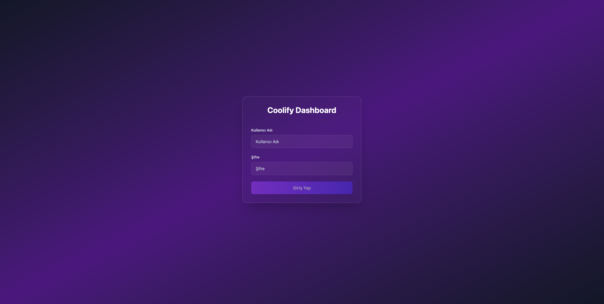
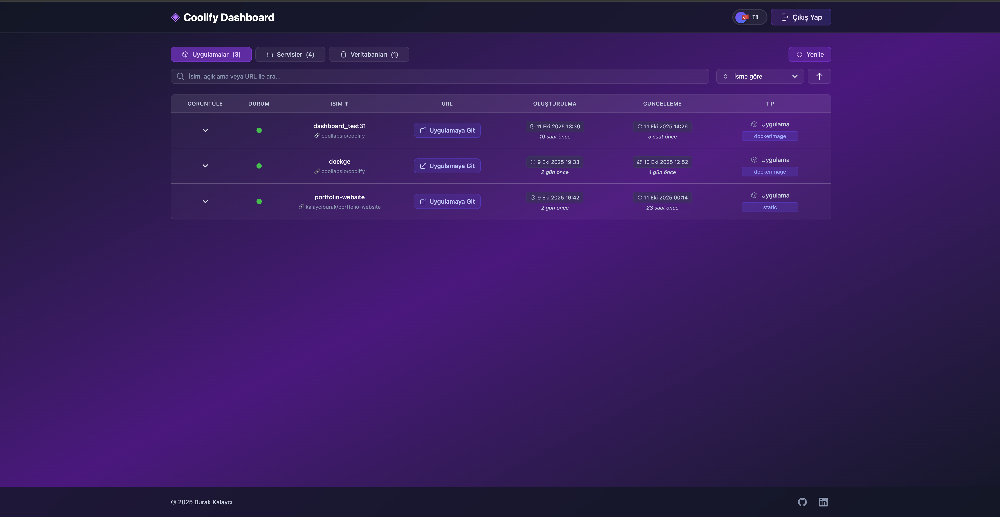
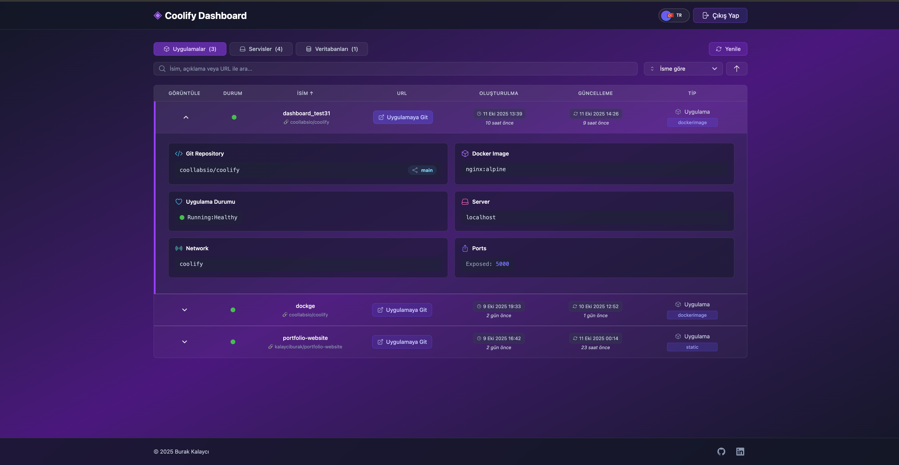
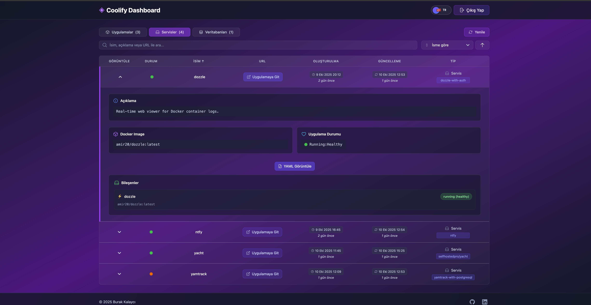
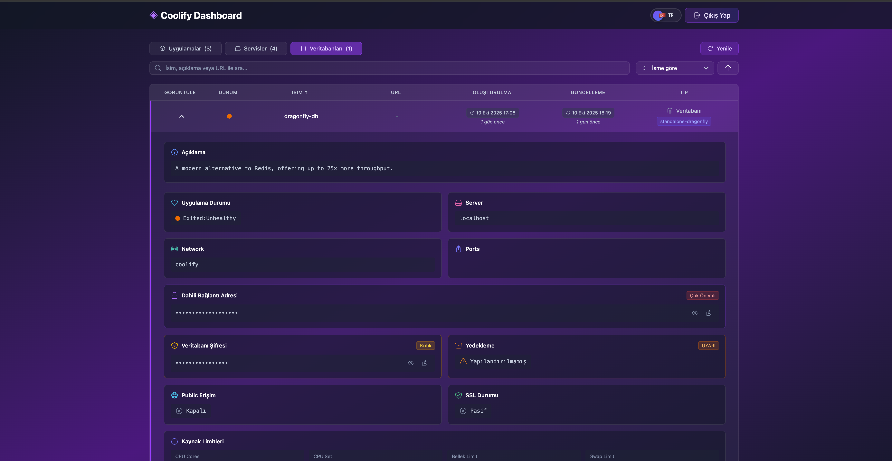
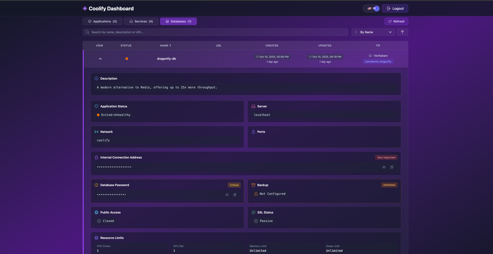

# Coolify Dashboard

Coolify uygulamaları, servisleri ve veritabanlarını yönetmek için modern bir dashboard.
Çok dilli destek (İngilizce/Türkçe) içerir.

---

## 🚀 Hızlı Başlangıç

### Docker Kullanarak

```bash
# En son imajı çek ve çalıştır
docker pull torukobyte/coolify-dashboard:latest

docker run -d -p 5000:5000 \
  --name coolify-dashboard \
  -e "ADMIN_USERNAME=admin" \
  -e "ADMIN_PASSWORD=sifreniz" \
  -e "JWT_SECRET=jwt_secret_iniz" \
  -e "ALLOWED_ORIGINS=http://localhost:5000" \
  -e "COOLIFY_BASE_URL=https://coolify-instance-iniz.com" \
  -e "COOLIFY_TOKEN=coolify_token_iniz" \
  torukobyte/coolify-dashboard:latest
```

Dashboard’a `http://localhost:5000` adresinden erişin.

---

## 🖥️ Ekran Görüntüleri

### 1️⃣ Giriş Ekranı


_Modern mor degrade arka plan üzerine sade giriş formu._

### 2️⃣ Uygulamalar Genel Görünüm


_Tüm dağıtılmış uygulamaların durumu, oluşturulma ve güncellenme zamanları._

### 3️⃣ Uygulama Detayları


_Git repository, port bilgileri ve çalışma durumu dahil detaylı görünüm._

### 4️⃣ Servis Detayları


_Bir servisin Docker imajı, bileşenleri ve çalışma durumu._

### 5️⃣ Veritabanı Detayları


_Veritabanı bağlantısı, SSL durumu ve yedekleme bilgileri._

### 6️⃣ Çok Dilli Destek


_İngilizce ve Türkçe arasında tek tıkla sorunsuz geçiş._

---

## ⚙️ Ortam Değişkenleri

| Değişken           | Açıklama                         | Gerekli |
| ------------------ | -------------------------------- | ------- |
| `ADMIN_USERNAME`   | Dashboard admin kullanıcı adı    | Evet    |
| `ADMIN_PASSWORD`   | Dashboard admin şifresi          | Evet    |
| `JWT_SECRET`       | Kimlik doğrulama için JWT secret | Evet    |
| `ALLOWED_ORIGINS`  | CORS izin verilen kaynaklar      | Evet    |
| `COOLIFY_BASE_URL` | Coolify instance URL’niz         | Evet    |
| `COOLIFY_TOKEN`    | Coolify API token’ınız           | Evet    |

---

## 🧩 Özellikler

- Çok Dilli Destek (İngilizce 🇬🇧 / Türkçe 🇹🇷)
- Responsive ve modern arayüz
- Gerçek zamanlı kaynak izleme
- Güvenli JWT kimlik doğrulama
- Kaynak Yönetimi (Uygulamalar, Servisler, Veritabanları)
- React + Tailwind CSS ile modern tasarım

---

## 🧱 Proje Yapısı

```
coolify-dashboard/
├── client/                 # React frontend
│   ├── src/
│   │   ├── components/     # Yeniden kullanılabilir bileşenler
│   │   ├── pages/          # Sayfa bileşenleri
│   │   ├── api/            # API servisleri
│   │   ├── services/       # İş mantığı
│   │   ├── utils/          # Yardımcı fonksiyonlar
│   │   └── i18n/           # Uluslararasılaştırma (EN/TR)
├── server/                 # Express backend
│   ├── routes/             # API route’ları
│   ├── middleware/         # Özel middleware
│   └── services/           # Backend servisleri
```

---

## 🧠 Geliştirme

### Gereksinimler

- Node.js 20+
- npm

### Kurulum

```bash
git clone https://github.com/kalayciburak/coolify-dashboard.git
cd coolify-dashboard
npm install
npm run dev
```

### Mevcut Script’ler

| Komut            | Açıklama                                            |
| ---------------- | --------------------------------------------------- |
| `npm run dev`    | Hem client hem server’ı geliştirme modunda başlatır |
| `npm run build`  | Client’ı production için derler                     |
| `npm run start`  | Production server’ı başlatır                        |
| `npm run lint`   | ESLint ile kod kontrolü yapar                       |
| `npm run format` | Kodu Prettier ile formatlar                         |

---

## 🤝 Katkıda Bulunma

1. Repository’yi fork edin
2. Yeni bir feature branch oluşturun: `git checkout -b feature/harika-ozellik`
3. Değişikliklerinizi yapın ve commit edin: `git commit -m 'Harika özellik ekle'`
4. Branch’e push edin: `git push origin feature/harika-ozellik`
5. Pull Request açın

### Kurallar

- Mevcut kod stiline sadık kalın
- Anlamlı commit mesajları yazın
- Yeni özellikler için test ekleyin
- Gerektiğinde dokümantasyonu güncelleyin
- PR göndermeden önce tüm testlerin geçtiğinden emin olun

---

## 📜 Lisans

Bu proje **MIT Lisansı** altında lisanslanmıştır — detaylar için [LICENSE](LICENSE) dosyasına bakın.

---

## 💬 Destek

Sorularınız, önerileriniz veya hata raporlarınız için
[GitHub Issues](https://github.com/kalayciburak/coolify-dashboard/issues) sayfasından iletişime geçebilirsiniz.
