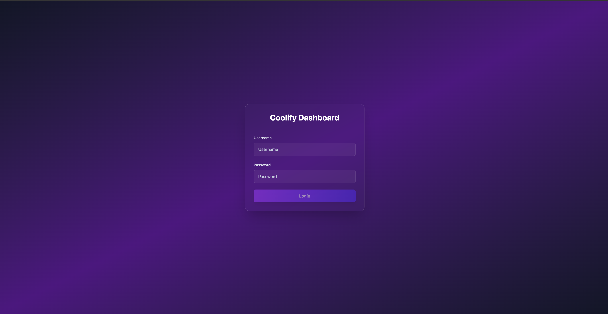
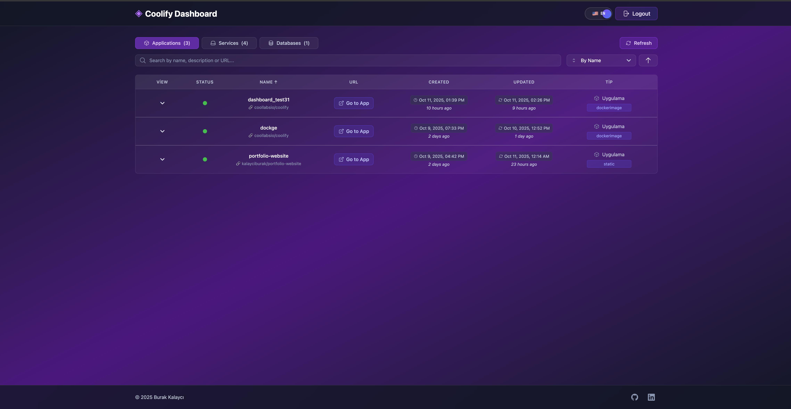
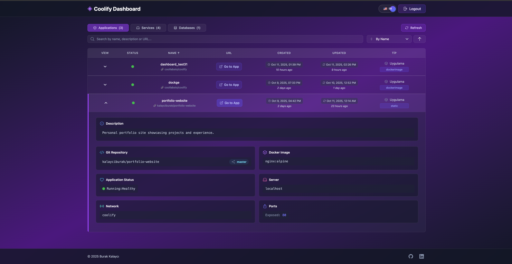
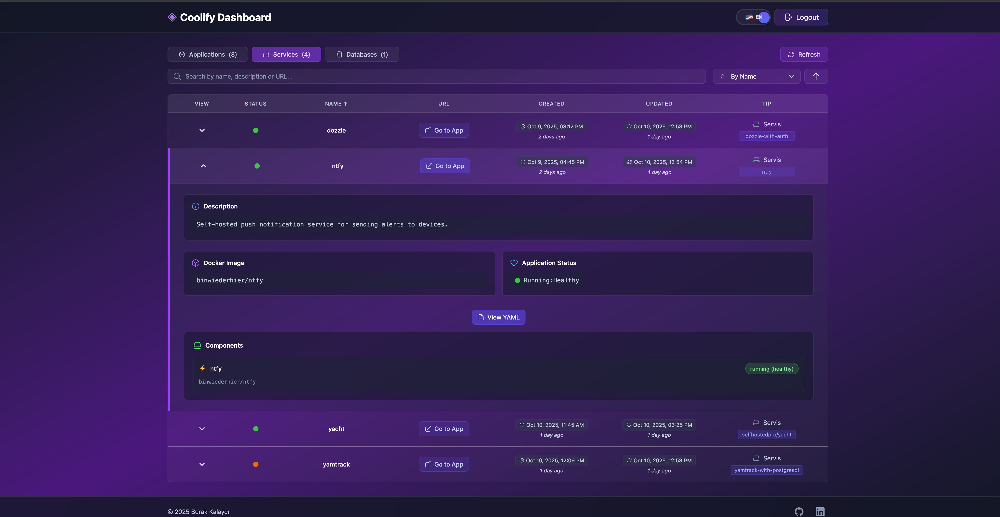
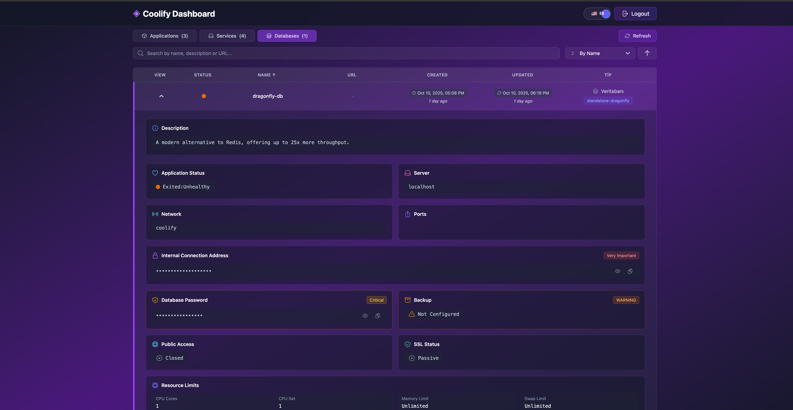
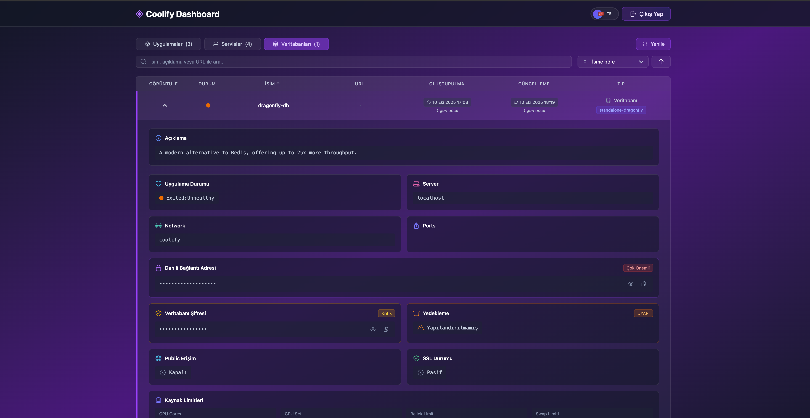

# Coolify Dashboard

A modern dashboard for managing Coolify applications, services, and databases with multi-language support (English/Turkish).

---

## 🚀 Quick Start

### Using Docker

```bash
# Pull and run the latest image
docker pull torukobyte/coolify-dashboard:latest

docker run -d -p 5000:5000 \
  --name coolify-dashboard \
  -e "ADMIN_USERNAME=admin" \
  -e "ADMIN_PASSWORD=your_password" \
  -e "JWT_SECRET=your_jwt_secret" \
  -e "ALLOWED_ORIGINS=http://localhost:5000" \
  -e "COOLIFY_BASE_URL=https://your-coolify-instance.com" \
  -e "COOLIFY_TOKEN=your_coolify_token" \
  torukobyte/coolify-dashboard:latest
```

Access the dashboard at `http://localhost:5000`

---

## 🖥️ Screenshots

### 1️⃣ Login Screen


_The login page with a clean purple gradient background and centered authentication form._

### 2️⃣ Applications Overview


_List of deployed applications with status, creation/update times, and quick access buttons._

### 3️⃣ Application Details


_Detailed view of an application including Git repository, image, ports, and runtime status._

### 4️⃣ Services Overview


_Overview of running services with their Docker image info and health states._

### 5️⃣ Database Details


_Configuration details of databases including connection info, SSL, and backup status._

### 6️⃣ Multi-language Support


_Seamless switching between English and Turkish, preserving the modern Coolify aesthetic._

---

## ⚙️ Environment Variables

| Variable           | Description                   | Required |
| ------------------ | ----------------------------- | -------- |
| `ADMIN_USERNAME`   | Dashboard admin username      | ✅ Yes   |
| `ADMIN_PASSWORD`   | Dashboard admin password      | ✅ Yes   |
| `JWT_SECRET`       | JWT secret for authentication | ✅ Yes   |
| `ALLOWED_ORIGINS`  | CORS allowed origins          | ✅ Yes   |
| `COOLIFY_BASE_URL` | Your Coolify instance URL     | ✅ Yes   |
| `COOLIFY_TOKEN`    | Your Coolify API token        | ✅ Yes   |

---

## 🧩 Features

- Multi-language Support (English 🇬🇧 / Turkish 🇹🇷)
- Responsive Design with Modern UI
- Real-time Resource Monitoring
- Secure JWT Authentication
- Manage Applications, Services & Databases
- Built with React + Tailwind CSS + Express.js

---

## 🧱 Project Structure

```
coolify-dashboard/
├── client/                 # React frontend
│   ├── src/
│   │   ├── components/     # Reusable components
│   │   ├── pages/          # Page components
│   │   ├── api/            # API services
│   │   ├── services/       # Business logic
│   │   ├── utils/          # Utility functions
│   │   └── i18n/           # Internationalization (EN/TR)
├── server/                 # Express backend
│   ├── routes/             # API routes
│   ├── middleware/         # Custom middleware
│   └── services/           # Backend logic
```

---

## 🧠 Development

### Prerequisites

- Node.js 20+
- npm

### Setup

```bash
git clone https://github.com/kalayciburak/coolify-dashboard.git
cd coolify-dashboard
npm install
npm run dev
```

### Available Scripts

| Command          | Description                                    |
| ---------------- | ---------------------------------------------- |
| `npm run dev`    | Start both client & server in development mode |
| `npm run build`  | Build frontend for production                  |
| `npm run start`  | Start production server                        |
| `npm run lint`   | Run ESLint checks                              |
| `npm run format` | Format code using Prettier                     |

---

## 🧑‍💻 Contributing

1. Fork the repository
2. Create a feature branch: `git checkout -b feature/amazing-feature`
3. Commit your changes: `git commit -m 'Add amazing feature'`
4. Push to the branch: `git push origin feature/amazing-feature`
5. Open a Pull Request

**Guidelines**

- Follow existing code style
- Write meaningful commit messages
- Add tests for new features
- Update documentation if needed
- Ensure all tests pass before PR submission

---

## 📜 License

This project is licensed under the **MIT License** — see the [LICENSE](LICENSE) file for details.

---

## 💬 Support

For issues or feature requests, please open an issue on [GitHub](https://github.com/kalayciburak/coolify-dashboard).
